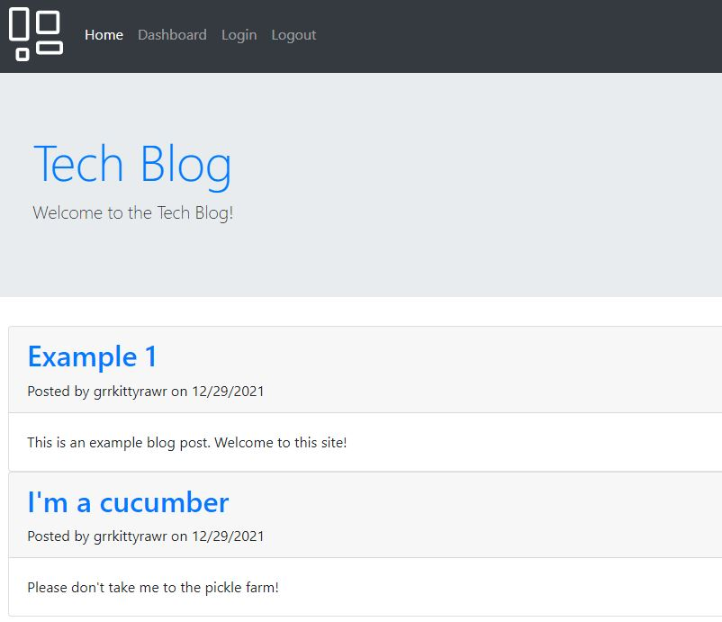

# tech-blog

## Table of Contents
- [About](#about)
- [User Story](#user_story)
- [Technologies](#technologies)
- [Examples](#examples)
- [Author(s)](#author(s))

## About
I built a CMS-style blog site similar to a Wordpress site, where developers can publish their blog posts and comment on other developers’ posts as well. This site was built completely from scratch and deployed to Heroku. It follows the MVC paradigm in its architectural structure, using Handlebars.js as the templating language, Sequelize as the ORM, and the express-session npm package for authentication.

## User Story
As a developer who writes about tech, I want a CMS-style blog site so that I can publish articles, blog posts, and my thoughts and opinions.

## Technologies
This application was created using:
- [NPM (Inquirer)](https://www.npmjs.com/package/inquirer)
- [JavaScript](https://www.javascript.com/)
- [bcrypt](https://www.npmjs.com/package/bcrypt)
- [connect-session-sequelize](https://www.npmjs.com/package/connect-session-sequelize)
- [dotenv](https://www.npmjs.com/package/dotenv)
- [Express](https://www.npmjs.com/package/express)
- [express-handlebars](https://www.npmjs.com/package/express-handlebars)
- [express-session](https://www.npmjs.com/package/express-session)
- [MySql2](https://www.npmjs.com/package/mysql2)
- [Sequelize](https://www.npmjs.com/package/sequelize)

## Examples
A photo of the homepage:  

 

Deployed blog can be found [here](https://mtf-tech-blog.herokuapp.com/).

## Author(s)
- [Megan Teubner-Foster](https://www.github.com/mteubnerfoster)